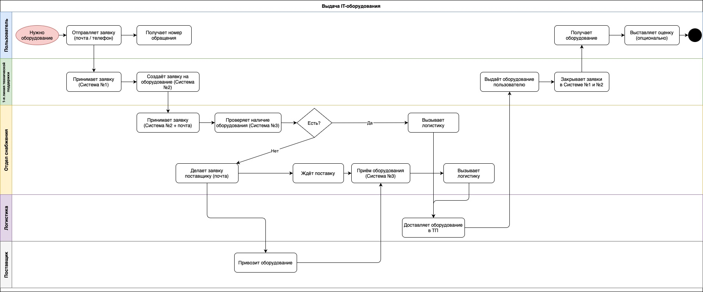

# Техническое задание — Бизнес-аналитик / Системный аналитик
Антоненко Анна Георгиевна

---

## Задача 1: BPMN 2.0 — Выдача IT-оборудования



### Вопросы и противоречия к описанию

В процессе моделирования возникло несколько вопросов, которые стоит уточнить перед тем как считать модель финальной:

1. **Кто создаёт запись в Системе №1?** Пользователь подаёт заявку по почте или телефону, но непонятно кто именно фиксирует её в системе — сам пользователь или 1-я линия ТП. Скорее всего это делает ТП, но в описании это явно не указано.

2. **Как именно вызывается логистика?** Написано "вызывает логистику", но канал не описан — это звонок, заявка в системе или почта? Для корректной модели это важно.

3. **Нет SLA на ожидание поставки.** Если поставщик не привёз оборудование в срок — что происходит с заявкой? Эскалация, отмена, повторный запрос?

4. **Оценка сервиса.** Описано что пользователь "может выставить оценку", но не указано куда она попадает и кто с ней работает.

5. **Нет уведомлений пользователя.** После подачи заявки пользователь получает только номер обращения. Информируют ли его о статусе в процессе — непонятно.

---

## Задача 2: User Story и Use Case — публикация товара на маркетплейсе

### User Story

**Как** продавец в Личном кабинете,
**я хочу** опубликовать свой товар на витрине маркетплейса,
**чтобы** покупатели могли найти и купить его.

**Критерии приёмки:**
- Продавец может заполнить карточку товара: название, описание, цена, категория, фото
- Система проверяет обязательные поля перед публикацией
- После публикации товар появляется на витрине
- Продавец получает подтверждение об успешной публикации
- Можно сохранить черновик и вернуться к нему позже

---

### Use Cases

#### UC-01: Создание и публикация товара

**Актор:** Продавец

**Предусловие:** Продавец авторизован, аккаунт верифицирован.

**Основной поток:**
1. Продавец нажимает «Добавить товар»
2. Система показывает форму создания карточки
3. Продавец заполняет название, описание, цену, категорию, загружает фото
4. Продавец нажимает «Опубликовать»
5. Система валидирует обязательные поля
6. Товар публикуется на витрине
7. Система показывает подтверждение

**Альтернативный поток A — не заполнены обязательные поля:**
- На шаге 5 система подсвечивает незаполненные поля
- Продавец заполняет и снова нажимает «Опубликовать»

**Альтернативный поток B — сохранение черновика:**
- На шаге 4 продавец нажимает «Сохранить черновик»
- Карточка сохраняется со статусом «Черновик»
- Продавец может вернуться к редактированию позже

**Постусловие:** Товар опубликован и виден на витрине.

---

#### UC-02: Редактирование опубликованного товара

**Актор:** Продавец

**Предусловие:** Товар уже опубликован.

**Основной поток:**
1. Продавец открывает список своих товаров
2. Выбирает нужный → нажимает «Редактировать»
3. Вносит изменения
4. Нажимает «Сохранить»
5. Система обновляет карточку на витрине

---

#### UC-03: Снятие товара с публикации

**Актор:** Продавец

**Основной поток:**
1. Продавец выбирает товар из списка
2. Нажимает «Снять с продажи»
3. Система переводит товар в статус «Архив»
4. Товар перестаёт отображаться на витрине

---

## Задача 3.1: REST API — Регистрация пользователя

### Метод и URL

```
POST /api/v1/users/register
```

---

### Входные параметры (Request Body, application/json)

| Параметр | Тип | Обязательный | Ограничения |
|----------|-----|:---:|-------------|
| firstName | string | да | 1–50 символов, только буквы |
| lastName | string | да | 1–50 символов, только буквы |
| username | string | да | 3–30 символов, латиница/цифры/нижнее подчёркивание |
| password | string | да | мин. 8 символов; цифра, заглавная, строчная, спецсимвол |
| recaptchaToken | string | да | токен Google reCAPTCHA v2 |

---

### Выходные параметры — успешный ответ (200 OK)

| Параметр | Тип | Описание |
|----------|-----|---------|
| message | string | "User Register Successfully" |
| userId | string (UUID) | ID созданного пользователя |

---

### Коды ответов и ошибки

| Код | Условие | Сообщение |
|-----|---------|-----------|
| 200 | Пользователь создан | "User Register Successfully" |
| 400 | Невалидный пароль | "Passwords must have at least one non alphanumeric character, one digit ('0'-'9'), one uppercase ('A'-'Z'), one lowercase ('a'-'z'), one special character and Password must be eight characters or longer." |
| 400 | Не пройдена reCAPTCHA | "Please verify reCaptcha to register!" |
| 400 | Не заполнено обязательное поле | "Field {fieldName} is required" |
| 409 | Username уже занят | "User exists!" |
| 500 | Внутренняя ошибка | "Internal server error. Please try again later." |

---

### Пример запроса

```http
POST /api/v1/users/register
Content-Type: application/json

{
  "firstName": "Ivan",
  "lastName": "Ivanov",
  "username": "ivan",
  "password": "MyPass1!",
  "recaptchaToken": "03AGdBq25..."
}
```

### Пример успешного ответа

```http
HTTP/1.1 200 OK

{
  "message": "User Register Successfully",
  "userId": "a1b2c3d4-e5f6-7890-abcd-ef1234567890"
}
```

### Пример ответа с ошибкой — пользователь существует

```http
HTTP/1.1 409 Conflict

{
  "error": "USER_EXISTS",
  "message": "User exists!"
}
```

### Пример ответа с ошибкой — невалидный пароль

```http
HTTP/1.1 400 Bad Request

{
  "error": "INVALID_PASSWORD",
  "message": "Passwords must have at least one non alphanumeric character, one digit ('0'-'9'), one uppercase ('A'-'Z'), one lowercase ('a'-'z'), one special character and Password must be eight characters or longer."
}
```

---

## Задача 3.2: Алгоритм создания пользователя на бэкенде

После получения запроса бэкенд последовательно выполняет следующие проверки — если любая из них не пройдена, создание пользователя прерывается и возвращается ошибка.

**Шаг 1 — Проверка наличия всех полей**

Все пять полей обязательны. Если хотя бы одно отсутствует или пустое — возвращаем 400 с указанием какое поле пропущено.

**Шаг 2 — Верификация reCAPTCHA**

Отправляем `recaptchaToken` на Google reCAPTCHA API. Если токен невалидный или истёк — возвращаем 400 "Please verify reCaptcha to register!". Этот шаг важно делать до обращения к БД, чтобы не нагружать базу ботами.

**Шаг 3 — Валидация формата полей**

Проверяем что `firstName` и `lastName` содержат только буквы (1–50 символов), `username` — только латиницу, цифры и нижнее подчёркивание (3–30 символов). Если не соответствует — 400.

**Шаг 4 — Валидация пароля**

Пароль должен быть не короче 8 символов и содержать: цифру, заглавную букву, строчную букву и спецсимвол. Если требования не выполнены — 400 с полным текстом требований (именно тот текст, что показывается на экране).

**Шаг 5 — Проверка уникальности username**

Делаем запрос к БД: ищем пользователя с таким username. Если нашли — возвращаем 409 "User exists!". Проверяем до создания записи, чтобы не нарушать уникальный индекс.

**Шаг 6 — Хэширование пароля**

Хэшируем пароль через bcrypt с salt rounds не менее 10. В БД никогда не попадает открытый пароль.

**Шаг 7 — Создание записи в БД**

Вставляем нового пользователя: `id` генерируем как UUID v4 на стороне сервера, `created_at` — текущее UTC-время. Если INSERT упал с ошибкой (например, race condition по username) — возвращаем 500.

**Шаг 8 — Ответ клиенту**

Возвращаем 200 с `message` и `userId`. Пароль и его хэш в ответ никогда не включаем.
